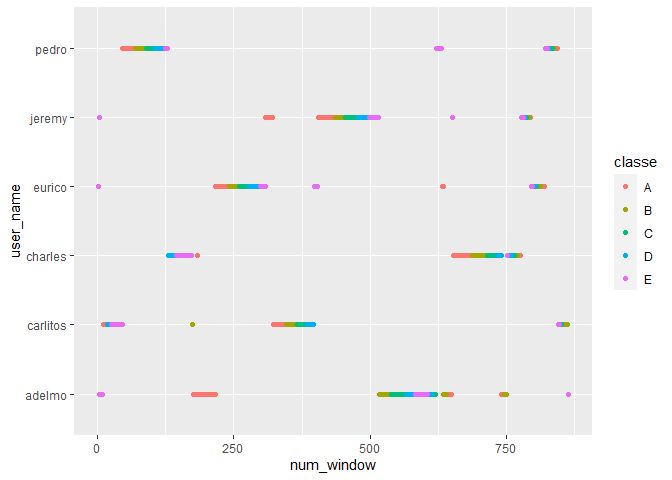
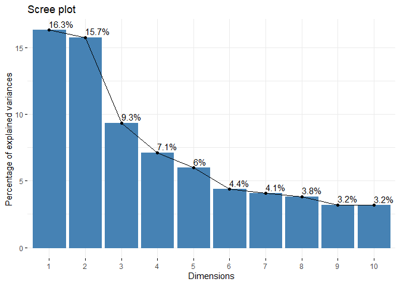

## Introduction

In this project, we are given a set of accelerometer data recording the exercises of self-proclaimed fitness buffs, accompanied by a variable "classe" which represents the assessed "quality" of a given exercise. Our task is to see if we can use this accelerometer data to predict the "classe" of exercises for which the classe result is not explicitly given. We also have a handful of other variables, such as the "user" of the devices, to aid in our predictions.

We will primarily use the caret package in R, whose train function is compatibile with a variety of predictive machine learning algorithms. The two techniques we will explore in my project are boosting and random forests. Spoiler alert: random forests are better in this instance.


```r
pml<-read.csv("../pml-training.csv",stringsAsFactors=FALSE)
```

## Data Cleaning ( and Making a Tidy Data Set)

My wife is an actual data scientist (compared to me, who is just trying to learn the basics on Coursera) and tells me that a typical ratio of time spent cleaning data versus actually developing models is usually at least 80:20 and often closer to 90:10. This project was certainly no exception. Let's start by taking a look at just how big this dataset and also how many columns have a data type of character (i.e., NOT numeric or integer).


```r
dim(pml)
```

```
## [1] 19622   160
```

```r
names(pml)[lapply(pml,class)=="character"]
```

```
##  [1] "user_name"               "cvtd_timestamp"         
##  [3] "new_window"              "kurtosis_roll_belt"     
##  [5] "kurtosis_picth_belt"     "kurtosis_yaw_belt"      
##  [7] "skewness_roll_belt"      "skewness_roll_belt.1"   
##  [9] "skewness_yaw_belt"       "max_yaw_belt"           
## [11] "min_yaw_belt"            "amplitude_yaw_belt"     
## [13] "kurtosis_roll_arm"       "kurtosis_picth_arm"     
## [15] "kurtosis_yaw_arm"        "skewness_roll_arm"      
## [17] "skewness_pitch_arm"      "skewness_yaw_arm"       
## [19] "kurtosis_roll_dumbbell"  "kurtosis_picth_dumbbell"
## [21] "kurtosis_yaw_dumbbell"   "skewness_roll_dumbbell" 
## [23] "skewness_pitch_dumbbell" "skewness_yaw_dumbbell"  
## [25] "max_yaw_dumbbell"        "min_yaw_dumbbell"       
## [27] "amplitude_yaw_dumbbell"  "kurtosis_roll_forearm"  
## [29] "kurtosis_picth_forearm"  "kurtosis_yaw_forearm"   
## [31] "skewness_roll_forearm"   "skewness_pitch_forearm" 
## [33] "skewness_yaw_forearm"    "max_yaw_forearm"        
## [35] "min_yaw_forearm"         "amplitude_yaw_forearm"  
## [37] "classe"
```

A lot of our machine learning techniques only work with quantitative variables (integer or numeric) and I originally spent a lot of time trying to convert those columns into numeric values. As it turns out, most of that was a big waste of time because nearly all of those variables have no predictive value for the final testing data (there are only NAs for those columns). But I'll get to that in a moment.

So we have 160 columns and we would love to cut down on the number of columns we have to look at. Before we ever get to anything like principal component analysis, though, we have plenty of columns that are virtually unusable anyway, so the number of columns we have to track decreases quickly.

There are a few columns that have literally no useful information in the training data that we will immediately discard: #14 "kurtosis_yaw_belt", #17 "skewness_yaw_belt", #26 "amplitude_yaw_belt", #89 "kurtosis_yaw_dumbbell", #92 "skewness_yaw_dumbbell", #101 "amplitude_yaw_dumbbell", #127 "kurtosis_yaw_forearm", #130 "skewness_yaw_forearm", #139 "amplitude_yaw_forearm". We're also going to throw out #5 "cvtd_timestamp", which only spans a range of a week or so and just isn't worth the trouble formatwise (we already have the raw timestamps, anyway), and #6 "new window", of which 98% of entries have identical values "no". Collectively, all these indices are listed and stored as "badindices1".

There are a couple of other indices that we probably don't want to include in the model because they give us an unrealistic sense of model accuracy without really having any predictive value. The first is the first column, "X". Because the overall data table seems to be ordered by "classe" (i.e., all the A's come first, then all the B's, etc.), and X is really just the row number, X is a near-perfect predictor of classe. But the meaning of X in the final test set has nothing to do with X in the training set. So we need to ditch it. Furthermore, some of the other early columns seem to suggest some sort of time-based pattern to the way the experiment was conducted. In particular, look at the relationship between num_window and classe for each individual user:


```r
library(ggplot2)
g<-ggplot()
g<-g+geom_point(data=pml,aes(x=num_window,y=user_name,color=classe))
g
```

<!-- -->

We can see that for each user (each "row" of the plot, if you will), most of the observations fall in a single cluster of num_window values. And within those clusters, there is a clear descending pattern of "classe" from left to right for all six users. This might mean that the participants were deliberately instructed to use increasingly sloppy technique as they moved from window to window. There is no guarantee that this same approach was used for the test data, so we're going to remove this variable as well to prevent it from screwing up our predictive potential. For the same reasons, we're going to get rid of the time-related columns, since any trends there seem like they might be an artifact of the way the experiment was conducted. The columns we're removing in this category are stored in "badindices3".

And finally (but importantly), there are also a bunch of indices that have only NA values in the final "pml-testing.csv" file. There's no pointing modeling on variables that we can't compare to later (even if there is a significant relationship), so we're just going to remove these now as well. There are too many variables to list out here one at a time, but they correspond to the indices in "badindices3", "badindices4", and "badindices5" (spread out among three objects for readability).


```r
badindices1<-c(5,6,14,17,26,89,92,101,127,130,139)
badindices2<-c(1,3,4,7)
badindices3<-c(12,13,15,16,18,19,20,21,22,23,24,25,27,28,29,30,31,32,33,34,35,36,50,51,52,53,54,55,56,57,58,59,69,70,71,72,73,74,75)
badindices4<-c(76,77,78,79,80,81,82,83,87,88,90,91,93,94,95,96,97,98,99,100,103,104,105,106,107,108,109,110,111,112,125,126)
badindices5<-c(128,129,131,132,133,134,135,136,137,138,141,142,143,144,145,146,147,148,149,150)
pml2<-pml[-c(badindices1,badindices2,badindices3,badindices4,badindices5)]
pml2$user_name<-as.numeric(as.factor(pml2$user_name))
```

You can see that to allow our quantitatively-based models to work better, we've converted our user_name index into a quantitative variable. I.e., 1=Adelmo, 2=Carlitos, 3=Charles, 4=Eurico, 5=Jeremy, 6=Pedro.

We also have a bunch of columns that contain some (or even mostly) NA values. We have to deal with this somehow...in this case, we impute the NA values by replacing them with the mean of the non-NA values for that column.


```r
for(j in 1:(ncol(pml2)-1)){
    pml2[is.na(pml2[,j]), j] <- mean(pml2[,j], na.rm = TRUE)
}
```

## Preparing for Modeling

At last, we have a nice tidy data set that contains only quantitative values and a relatively manageable number of columns for computation. We'll want to test our predictive model before we get to the "final" test, so first let's divide our data into training and testing portions. I've used set.seed() here to allow for the reproducibility of these results.


```r
library(caret)
```

```
## Loading required package: lattice
```

```r
set.seed(522)
inTrain<-createDataPartition(y=pml2$classe,p=0.6,list=FALSE)
pmltrain<-pml2[inTrain,]
pmltest<-pml2[-inTrain,]
```

## Principal Components Analysis

So we're going to be building our model using the training data (i.e., "pmltrain").We'll do a quick principle components analysis (PCA) on the data to see how much of the variance is explained by just the first few linear combinations of our variables. Note that I've opted to use the package "factoextra" instead of caret's PCA capabilities, since I think it makes a really nice looking scree plot. It also spits out the eigenvalues really nicely if you want them, although I didn't call that function here since it takes up a ton of space.

Also, there are 54 remaining columns in our tidy data, so don't forget to remove the last column ("classe") when doing the PCA.


```r
library(factoextra)
```

```
## Welcome! Want to learn more? See two factoextra-related books at https://goo.gl/ve3WBa
```

```r
res.pca<-prcomp(data.matrix(pmltrain[,-54]),scale=T)
fviz_eig(res.pca,addlabels=TRUE)
```

<!-- -->

So, it's worth noting that no single parameter, even using PCA, is able to explain a particularly large percentage of our variance. Of our 53 remaining variables. In fact, we need 20 variables to explain 90% of the variance, and we need 38 variables to explain 99% of the variance. That's a pretty large percentage of the total of 53 remaining predictive variables. So, going forward, we're just going to predict based on all of them - no further reductions are needed.

## Baseline Boosting and Random Forest Models

So let's take a look at the "default" settings for the "gbm" (Gradient Boosting Machine) machine learning approach in the "caret" package. As justified before by our PCA, we're just going to model for all of our remaining predictive variables.


```r
set.seed(616)
gbm_default<-train(classe~.,data=pmltrain,method="gbm",verbose=FALSE)
```

Now for the random forest, I had originally planned on initially using the default settings for that as well. But it turns out that the default settings are actually quite rigorous and will take a ton of computational time for a dataset of this size. So, instead, I specified tuneGrid and trControl to help keep things bounded. As a baseline, I used just a small number of resampling iterations ("number") and just a small number of complete sets of folds ("repeats").


```r
set.seed(616)
control <- trainControl(method="repeatedcv", number=2, repeats=2)
mtry <- floor(sqrt(ncol(pmltrain)))
tunegrid <- expand.grid(.mtry=mtry)
rf_22 <- train(classe~., data=pmltrain, method="rf", metric="Accuracy", tuneGrid=tunegrid, trControl=control)
```

## Cross-Validation for the Baseline Models (In-Sample vs. Out-of-Sample Error)

Okay, we haven't actually seen how our baseline boosting and random forest models actually performed. We'll use "predict" to extend the model over both our training and test data sets (for "in-sample" and "out-of-sample" accuracy, respectively), and I've plopped everything together in a consolidated table so you can see everything at once.


```r
predgbmIS<-predict(gbm_default,pmltrain)
predgbmOS<-predict(gbm_default,pmltest)
predrf22IS<-predict(rf_22,pmltrain)
predrf22OS<-predict(rf_22,pmltest)
acctable<-data.frame(matrix(data=c(0,0,0,0,0,0),nrow=2,ncol=3))
names(acctable)=c("method","in-sample accuracy","out-of-sample accuracy")
acctable[1]<-c("Default Boost","2-2 Forest")
acctable[1,2]<-sum(predgbmIS==pmltrain$classe)/length(pmltrain$classe)
acctable[1,3]<-sum(predgbmOS==pmltest$classe)/length(pmltest$classe)
acctable[2,2]<-sum(predrf22IS==pmltrain$classe)/length(pmltrain$classe)
acctable[2,3]<-sum(predrf22OS==pmltest$classe)/length(pmltest$classe)
acctable
```

```
##          method in-sample accuracy out-of-sample accuracy
## 1 Default Boost          0.9772418              0.9609992
## 2    2-2 Forest          1.0000000              0.9940097
```

As you would expect, out-of-sample accuracy is lower than in-sample accuracy for both models. But I was still pleasantly surprised by how high it still was. In particular, I was pretty impressed by how well the relatively computationally "light" random forest model did. So, at this point we conclude that boosting is probably not worth our time and we focus on fine-tuning the random forest model. But first, let's take a look at where our random forest model is, and isn't, predicting correctly:

```r
table(predrf22OS,pmltest$classe)
```

```
##           
## predrf22OS    A    B    C    D    E
##          A 2229    6    0    0    0
##          B    2 1512   17    0    0
##          C    0    0 1351   15    1
##          D    0    0    0 1270    4
##          E    1    0    0    1 1437
```

We can see that we have a little bit of error in every category. Nearly all of these errors just miss the category by 1 (e.g., an exercise that is actually classe "C" might get misclassified as classe "B"), which is what you would expect. Out of all 7,800+ test points, there is just one genuinely baffling result, where an exercise that was actually classe "A" was misclassified as classe "E". It is such an extreme outlier that I suspect the "classe" column was just mis-entered in that instance.

## Fine-Tuning Our Random Forest

So our "baseline" random forest already did a very good job and it definitely seems to cleanly outperform the boost result, so let's just focus on tweaking the random forest a little bit. This time we increase the number of resampling iterations to 10 and increase the number of complete sets of folds to 3. 


```r
set.seed(616)
control <- trainControl(method="repeatedcv", number=10, repeats=3)
mtry <- floor(sqrt(ncol(pmltrain)))
tunegrid <- expand.grid(.mtry=mtry)
rf_A3 <- train(classe~., data=pmltrain, method="rf", metric="Accuracy", tuneGrid=tunegrid, trControl=control)
```

So now let's take a look at how this result compares to our previous boost and random forest results. We'll just tack on to the existing table so we can look at everything at once.


```r
predrfA3IS<-predict(rf_A3,pmltrain)
predrfA3OS<-predict(rf_A3,pmltest)
acctable[3,]=c(0,0,0)
acctable[3,1]="10-3 Forest"
acctable[3,2]=sum(predrfA3IS==pmltrain$classe)/length(pmltrain$classe)
acctable[3,3]<-sum(predrfA3OS==pmltest$classe)/length(pmltest$classe)
acctable
```

```
##          method in-sample accuracy out-of-sample accuracy
## 1 Default Boost          0.9772418              0.9609992
## 2    2-2 Forest          1.0000000              0.9940097
## 3   10-3 Forest          1.0000000              0.9943920
```

So our accuracy got just a bit better, but only barely. If we were trying to win a kaggle or something we could probably fine tune this even further, but for this project that would be overkill. It was certainly enough to get a 20/20 for the project quiz. In the interest of the honor code I won't provide those results here. However, comparison to the final test data could be achieved using the code below.


```r
realpmltest<-read.csv("../pml-testing.csv",stringsAsFactors=FALSE)
rpml2<-realpmltest[-c(badindices1,badindices2,badindices3,badindices4,badindices5)]
rpml2$user_name<-as.numeric(as.factor(rpml2$user_name))
for(j in 1:(ncol(rpml2)-1)){
    rpml2[is.na(rpml2[,j]), j] <- mean(rpml2[,j], na.rm = TRUE)
}
## predfinal<-predict(rf_A3,rpml2)
```

## Thanks for grading! Stay safe out there.
